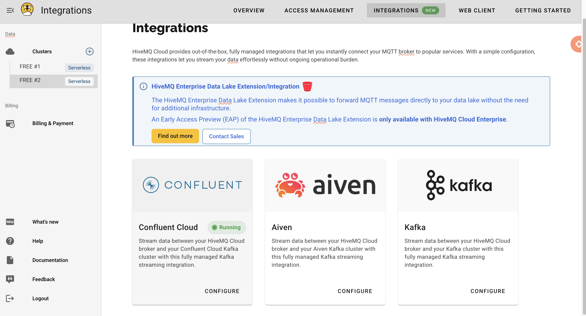

# Atividade ponderada - Integração com Metabase, persistencia de dados e uso do kafka
### Essa atividade é uma continuação da ponderada 1, 2 e 3

## Como rodar o código inteiro

### Pré requisitos:

- Ter docker rodando na máquina.
- Criar um banco de dados no Atlas MongoDB
- Criar um cluster no hiveMQ e um cluster no confluent para usar o sistema de mensageria kafka. Crie um tópico chamado `sensors_queue` e integre com o HiveMQ.



1. Na pasta `exercicios-mod9/ponderada-04/` crie um arquivo `.env` com as seguintes credenciais:

```
BROKER_ADDR = <link-broker-hive-mq>
HIVE_USER = <user-hive-mq>
HIVE_PSWD = <password>


CONFLUENT_BOOTSTRAP_SERVER_SASL=<bootstrap-confluent>
CONFLUENT_API_KEY=<api-key-confluent>
CONFLUENT_API_SECRET=<api-secret-confluent>

MONGO_DATABASE=<link-de-conexão-mongo-db-atlas>
```


2. Entrar no diretório `exercicios-mod9/ponderada-04/build` e rode o comando abaixo:
```
docker compose up
```

**Entre em http://localhost:3000/ para acessar a dashboard**

## Video do funcionamento

https://www.loom.com/share/91e7d619c2de4d6097d3cbb188f3e478
